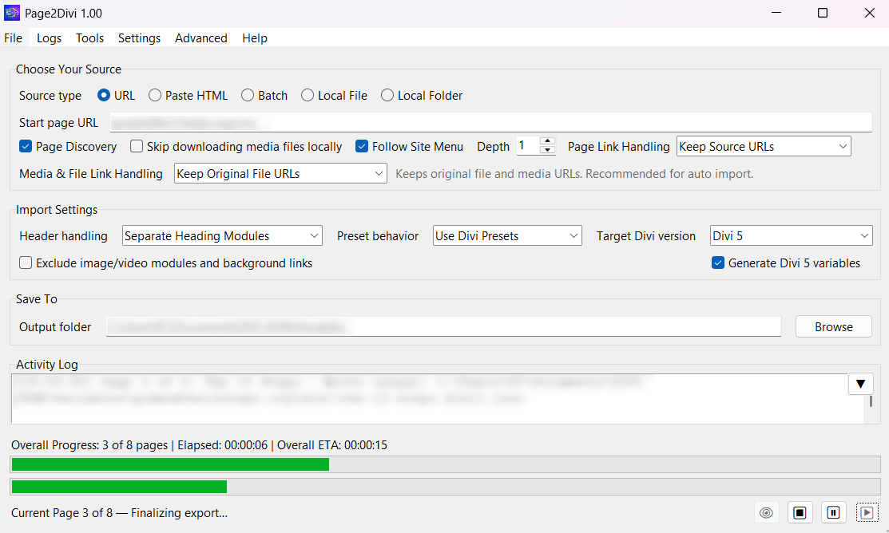

[](https://github.com/remarkablepc/Page2Divi/releases/latest)

# Page2Divi – Binary Releases

> Download Latest Release: [v1.00](https://github.com/remarkablepc/Page2Divi/releases/latest)

Page2Divi is a standalone desktop tool that converts webpages and HTML into Divi-compatible import JSON.

It rebuilds page structure from live URLs, pasted markup, local HTML / MHTML files, saved-page ZIPs, local folders, WordPress WXR exports, GetSimple CMS XML, and existing Divi 4 / 5 layouts, then writes a `.Divi4.json` or `.Divi5.json` file you import through the Divi Builder's Portability dialog.



_Sanitized example view of the desktop tool. Private URLs and local output paths are intentionally omitted._

[](https://github.com/remarkablepc/Page2Divi/releases/latest)
[](https://github.com/remarkablepc/Page2Divi/releases/latest)

---

## Highlights in v1.00 (Released July 2026 for the 250th of USA)

v1.00 is a major milestone release, bringing extensive parser coverage, import flexibility, compare diagnostics, UI refinements, and robust error/recovery controls:

- **Menu Nesting & Depth Controls:** The follow depth minimum is now set to 1 (removing the confusing 0 option). Depth 1 now strictly crawls top-level menu items only, while depth 2+ expands dropdown sub-menus as separate levels.
- **Fast Preview Prescan:** The Export Plan preview now performs a fast, single-page prescan (Level 1 menu links only) to give a quick expected page count estimate without slow full-site crawls.
- **Protocol-Relative Hrefs:** Fixed URL discovery and traversal when parsing protocol-relative links (`//domain.com/path`) on sites without explicit schemes in their base URL.
- **Redirect Deduplication:** Improved link crawler deduplication to recognize canonical redirected URLs so that start pages and their menu-equivalent homepages are not counted twice.
- **Smarter Content Link Labels:** Pages discovered through content links now dynamically fall back to the `page=` query parameter value or URL slug instead of using the generic `"page"` placeholder.
- **Tooltip Updates:** Redesigned and corrected the tooltips for "Follow Site Menu" and "Page Discovery" to match their actual, non-overlapping functions.
- **Kadence + Spectra Mapping Expanded:** Added local parser coverage for Kadence infobox, accordion, and advanced button blocks plus Spectra/UAGB info box, FAQ, and testimonial blocks so they land as Divi blurbs, toggles, testimonials, and buttons more reliably.
- **Elementor JSON Imports:** Page2Divi now accepts Elementor JSON template exports directly and can also consume generic JSON files that embed raw HTML, reducing the amount of manual pre-conversion cleanup needed for local imports.
- **Browser-Assisted Retry Controls:** The GUI now exposes browser/rendering fallback controls for off, ask, and automatic modes, along with timeout and manual-guidance options for script-rendered pages that still need human capture.
- **Compare Output Diagnostics:** Compare Source vs Output now includes exported Divi variable details in the technical report so new global strings and links are easier to verify after Divi 5 exports.
- **Clearer Multi-Page Run Feedback:** Follow-menu and page-discovery runs now provide more useful crawl feedback in the Activity Log.
- **Dual Progress Bars for Multi-Page Runs:** Multi-page batches now show a dedicated overall progress bar with overall ETA above the current-page progress bar, while single-page runs keep the simpler one-bar layout. The window also resizes when that extra batch row appears so the bottom controls remain visible.
- **Stale Output Cleanup:** Re-exports now remove prior JSON, HTML reference exports, and matching logs for the same source stem so the local output folder stays cleaner between runs.
- **Reference Export Refinements:** Local HTML preview/reference exports continue to separate text and preview outputs while preserving stylesheet-driven styling and local media paths more consistently.
- **Unified "Open..." & File Handling:** One action detects session profiles, logs, and comparison files. File naming uses version-specific `.Divi4.json` or `.Divi5.json` suffixes.
- **Skip Embedded Scripts:** Automatically removes `<script>` tags during conversion (enabled by default), eliminating blank spaces in Divi 4's Visual Builder caused by inline JavaScript.
- **Extract Visual Content from Scripts:** When skipping scripts, automatically extracts text, buttons, links, and image URLs from JavaScript-containing elements (enabled by default). Images referenced in JavaScript are downloaded and embedded in the JSON, provided media downloads and JSON media inclusion are enabled.
- **Batch Resume & Pause/Resume:** Active pause/resume during conversion, and the ability to resume interrupted or crashed runs from saved log files.
- **Safety Logs & Recovery:** Automated 30-day safety log pruning and manual cleanup tools.
- **Avada & Google Stitch Support:** Broadened builder coverage with full Avada/Fusion builder mapping and Google Stitch detection.
- **Refined User Interface:** Flattened menus, standardized ellipses, corner-nested rollup panels, and clipboard-copyable activity logs with toast notifications.
- **Enhanced Preferences:** Reset preferences to default and a redesigned batch URL list.
- **Improved In-App Docs:** Cleaner Conversion Matrix viewer and direct Quick Start / Documentation access.
- **Advanced Diagnostics:** Fallback rendering controls, environment summaries, file logging, and detailed traceback toggles.

---

## What it does

- Convert **live URLs** (single, batch, or sitemap.xml).
- Handle **JavaScript-heavy pages** with a private browser-assisted retry when the raw HTML is only a hydration shell.
- Convert **pasted HTML** straight from a browser, an editor, or dev tools.
- Convert **local files**: `.html`, `.mhtml`, `.zip` saved-page bundles, WordPress WXR XML, GetSimple CMS XML, or existing Divi 4 / 5 JSON.
- Convert **local folders** with sibling `images` / `assets` so relative links resolve.
- Rebuild the **section / row / column / module skeleton** with per-builder structural mappings.
- Open **Divi-aware compare views** for Preview results, saved exports, and the current source state so structural mismatches are easier to review.
- Preserve useful styling such as **background images and colors**, **padding / margin**, **heading font + size + weight**, **text color**, **alignment**, and **line-height** where the source exposes it.
- **Automatically skip embedded scripts** during conversion (enabled by default) to eliminate blank spaces in Divi 4's Visual Builder, while optionally extracting text, buttons, links, and images referenced in JavaScript for cleaner output.
- Download referenced **images, video posters, and same-site documents** into the output folder so the imported page is self-contained.
- Open the **Conversion Matrix inside the app** through a bundled, self-contained viewer.
- Save and reopen **session profiles (`.p2d`)**, activity logs (`.p2dlog`), or layout comparisons (`.p2dcompare`) via **File → Open…** (or their respective menus) so repeat jobs restore the same settings, or you can resume runs or inspect past comparisons.
- **Pause and resume active conversions** directly from the execution controls, or use **File → Open…** (or **Logs → Open/Resume from Log…**) to resume from an interrupted, stopped, or crashed batch run using `.p2dlog` files.
- Manage internal **safety logs** for crash recovery, with automatic 30-day pruning and a manual cleanup option in the **Tools** menu.
- Open **Quick Start**, **Documentation**, and **Check for Updates** directly from the Help menu.
- Use **advanced browser fallback and debug logging controls** when a page needs rendered capture or deeper troubleshooting.
- Emit **Divi 5 global variables** for supported repeated values and preserved source tokens when Divi 5 export is selected.
- Detect **WooCommerce / JSON-LD / microdata product pages** and emit Divi WooCommerce dynamic modules (`et_pb_wc_*`) plus a static fallback section.
- Run **entirely on your machine** – no telemetry, no login, no cloud.

---

## What it does not do

- It is not a WordPress plugin and does not modify Divi.
- It does **not** create Pages, Posts, Categories, Tags, Menu items, or WooCommerce products. The export is **page content only**.
- It does not produce pixel-perfect copies. Complex builder pages will still need cleanup.
- It does not bundle, redistribute, or download Divi. You bring your own Divi license.
- It is not tied to any account or service.

---

## Why this exists

I wrote Page2Divi because real-world Divi migrations are repetitive and slow. Copying content, rebuilding sections, relinking media, and hand-translating layouts from other builders wastes time before the real design work even starts.

The goal is not a perfect one-click clone. The goal is to give you a solid Divi starting point: structure, content, media, and as much useful styling as the source exposes, produced locally on your machine so you can inspect the output and finish the page properly.

---

## Who this is for

Page2Divi is for people who already work in Divi and want a practical head start.

- Designers and freelancers moving brochure sites into WordPress + Divi  
- Agencies migrating client sites from static HTML, exports, or other WordPress builders  
- Site owners consolidating content from legacy CMSs, saved pages, or existing site backups  
- Developers who want a local conversion tool they can preview, rerun, and troubleshoot without a cloud service  

If you need a pixel-perfect clone, this is the wrong tool. If you need a fast structural conversion that gets real content and media into Divi with much less manual rebuilding, this is what it is for.

---

## Changelog: v0076 to v1.00

This section details all changes, fixes, and improvements introduced between **v0076** and the **v1.00** production release (Released July 2026, celebrating the 250th anniversary of the USA):

### Core Conversion & Builder Coverage
- **Menu Nesting & Depth Controls:** The follow depth minimum is now set to 1 (removing the confusing 0 option). Depth 1 now strictly crawls top-level menu items only, while depth 2+ expands dropdown sub-menus as separate levels.
- **Fast Preview Prescan:** The Export Plan preview now performs a fast, single-page prescan (Level 1 menu links only) to give a quick expected page count estimate without slow full-site crawls.
- **Protocol-Relative Hrefs:** Fixed URL discovery and traversal when parsing protocol-relative links (`//domain.com/path`) on sites without explicit schemes in their base URL.
- **Redirect Deduplication:** Improved link crawler deduplication to recognize canonical redirected URLs so that start pages and their menu-equivalent homepages are not counted twice.
- **Smarter Content Link Labels:** Pages discovered through content links now dynamically fall back to the `page=` query parameter value or URL slug instead of using the generic `"page"` placeholder.
- **Kadence + Spectra Mapping Expanded:** Added local parser coverage for Kadence infobox, accordion, and advanced button blocks plus Spectra/UAGB info box, FAQ, and testimonial blocks so they land as Divi blurbs, toggles, testimonials, and buttons more reliably.
- **Elementor JSON Imports:** Page2Divi now accepts Elementor JSON template exports directly and can also consume generic JSON files that embed raw HTML, reducing the amount of manual pre-conversion cleanup needed for local imports.
- **Same-Site Menu Crawl Normalization:** Follow-menu and page-discovery batches now normalize `www` and non-`www` host variants as the same site during discovery so mixed-navigation sites do not drop pages.
- **Compare Output Diagnostics:** Compare Source vs Output now includes exported Divi variable details in the technical report so new global strings and links are easier to verify after Divi 5 exports.
- **Stale Output Cleanup:** Re-exports now remove prior JSON, HTML reference exports, and matching logs for the same source stem so the local output folder stays cleaner between runs.
- **Reference Export Refinements:** Local HTML preview/reference exports continue to separate text and preview outputs while preserving stylesheet-driven styling and local media paths more consistently.
- **Downloaded Media Marker Fixes:** The Compare Media tab now preserves the downloaded-file floppy marker whenever a file exists locally, even if the exported output path is online, relative, or retargeted.
- **Output File Suffixes & Structure:** Output files are now automatically appended targeted version suffixes (`.Divi4.json` or `.Divi5.json`) based on your targeted Divi version. The output directory is reorganized into clean subfolders under `output/<domain>/`: layouts in `\Divi`, logs and layouts mockups in `\logs`, experimental templates in `\HTML`, and the unified `.p2dcompare` comparison file at the root.
- **Skip Embedded Scripts:** New preference option (enabled by default) removes `<script>` tags during conversion, eliminating blank spaces in Divi 4's Visual Builder caused by inline JavaScript code.
- **Extract Visual Content from Scripts:** When skipping embedded scripts, optionally extracts text, buttons, links, and image URLs from JavaScript-containing elements (enabled by default). Images referenced in JavaScript (e.g., avatar URLs in form data) are automatically downloaded and embedded in the JSON, provided media downloads and JSON media inclusion are enabled.
- **Divi 5 Global Variables:** Significantly improved and fixed the generation of Divi 5 global variables for supported repeated fields (blurbs, buttons, images, headings, sliders, tabs, toggles, testimonials, etc.) and preserved source tokens so they link correctly upon import.
- **Avada Theme & Builder Support:** Added deep detection and conversion matrix mapping for Avada/Fusion builder elements (containers, rows, columns, and modules) across shortcodes, JSON signatures, and rendered HTML classes.
- **Google Stitch Detection:** Added Google Stitch detection and HTML-heuristic conversion support.
- **Image & Background Path Rewriting:** Layout exports now rewrite and map image/background paths (including slider items, video posters, and `` tags inside text module HTML) to respect the selected `Downloaded File Links` settings. Relative media paths are automatically restored to their original absolute URLs in default mode so that Divi can sideload them into WordPress, and support base URL prepending when configured.

### Recovery, Logging & Advanced Controls
- **Browser-Assisted Retry Controls:** The GUI now exposes browser/rendering fallback controls for off, ask, and automatic modes, along with timeout and manual-guidance options for script-rendered pages that still need human capture.
- **Cached Menu Prescan:** Start-page menu discovery now reuses a cached prescan snapshot instead of re-fetching the same page repeatedly during preview flows.
- **Follow-Menu Discovery Logging:** Activity Log entries now distinguish between pages found from the main menu (`Main Menu Item Found -> ...`) and pages discovered from in-content links (`Page Discovered -> ...`) during multi-page URL runs.
- **Batch Resume & Pause/Resume:** Added active pause/resume (`⏸ / ▶`) controls during conversions, and the ability to load a `.p2dlog` file via **File → Open…** (or **Logs → Open/Resume from Log…**) to resume from stop, pause, or crashed states.
- **Safety Logs & Pruning:** Introduced internal safety logs for crash recovery with automatic 30-day pruning and a **Clear Safety Logs** tool menu command.
- **Advanced Diagnostic Controls:** New `Advanced` menu controls for browser/rendering fallback behavior and debug logging, including environment summaries, persisted fallback settings, file logging, and optional traceback display for runtime errors.

### UI & UX Enhancements
- **Tooltip Updates:** Redesigned and corrected the tooltips for "Follow Site Menu" and "Page Discovery" to match their actual, non-overlapping functions.
- **Clearer Multi-Page Run Feedback:** Follow-menu and page-discovery runs now provide more useful crawl feedback in the Activity Log.
- **Dual Progress Bars for Multi-Page Runs:** Multi-page batches now show a dedicated overall progress bar with overall ETA above the current-page progress bar, while single-page runs keep the simpler one-bar layout. The window also resizes when that extra batch row appears so the bottom controls remain visible.
- **Flattened and Simplified Menus:** Cleaned up the **Settings** menu and flattened the **Tools** menu, bringing diagnostic comparison tools (**Compare Source vs Output…** and **Compare JSON Files…**) directly to the top-level menu.
- **Ellipsis Standardization:** Standardized the use of Unicode ellipses (`…`) across all menus to clearly indicate which options trigger dialogs or require further input (e.g., `Preferences…`, `About Page2Divi…`).
- **Enhanced Preferences Dialog:** Titled **Default Preferences** for extra clarity, featuring a dedicated **Reset to Defaults** button.
- **Redesigned Batch URL List:** Refactored into a clean, non-collapsible container panel with dynamic, auto-hiding scrollbars and grey placeholder guidance.
- **Corner-Nested Rollup Controls:** Rollup buttons for the **Paste HTML** and **Activity Log** panels are now nested cleanly in the top-right corner of their borders, saving vertical space. Collapsed views retain a 2-line context preview.
- **Streamlined Activity Log:** Removed redundant headers and added click-to-copy behavior across the entire frame with a tooltip explanation and clipboard toast notification.
- **Granular Progress Bar:** Shows determinate progress increments during execution, with fixed monotonic update behavior so it doesn't prematurely reset to 0%.
- **Terminology Standardization:** Renamed "Source Folder" to "Local Folder" across all user interface elements, error messages, and documentation.

---

# Running on Windows

1. Download the Windows zip from the [latest release](https://github.com/remarkablepc/Page2Divi/releases/latest).  
2. Extract the zip. Run `Page2Divi.exe` – no installer, no admin.  
3. SmartScreen may show *"More info → Run anyway"* on the first launch because the EXE is not CA code-signed.

---

# Running on macOS (early release)

> **The macOS build is an early release and hasn’t been fully tested yet.**  
> It builds from the same source tree and the code paths it touches are cross-platform, but Mac-specific behaviour (Gatekeeper, file dialogs, Tk on Retina, etc.) has not been verified end-to-end. Please open an issue if anything breaks.

1. Download the macOS universal2 zip from the [latest release](https://github.com/remarkablepc/Page2Divi/releases/latest).  
2. Unzip it. You will get `Page2Divi.app`. Move it to `/Applications` (optional but recommended).  
3. The `.app` is **not code-signed or notarized**, so macOS will refuse to launch it on a double-click. To allow it once: **Right-click → Open → Open**.  
4. If macOS still refuses with *"...is damaged and cannot be opened"*, strip the quarantine attribute:

```bash
xattr -dr com.apple.quarantine /Applications/Page2Divi.app
```

### Command-line usage on macOS

```bash
/Applications/Page2Divi.app/Contents/MacOS/Page2Divi --url "https://example.com/page" --divi-version divi4
/Applications/Page2Divi.app/Contents/MacOS/Page2Divi --sitemap "https://example.com/sitemap.xml"
```

A shell alias makes that less painful:

```bash
alias page2divi='/Applications/Page2Divi.app/Contents/MacOS/Page2Divi'
page2divi --url "https://example.com/page"
```

---

## JavaScript-heavy pages and browser-assisted capture

Some modern sites, especially Wix and similar script-heavy stacks, do not expose their real content in the first HTML response. In those cases Page2Divi can offer a **private browser-assisted retry** that captures a rendered snapshot using an isolated browser profile instead of relying on your regular browser session.

That means:

- better results on hydration-shell pages,
- clearer Activity Log messages about when a rendered snapshot was used,
- and less need to manually copy the DOM out of your normal browser.

---

## Builder and platform coverage

WordPress core themes, Gutenberg core blocks, Elementor (live URL + JSON template export), Beaver Builder, Bricks Builder, WPBakery / Visual Composer, Avada / Fusion Builder (rendered classes, shortcode sources, and json signatures), Oxygen, Thrive Architect, Astra theme + Spectra / UAGB blocks, Kadence Blocks, Divi 4 / Divi 5 source pages (with module-level Divi 4 to Divi 5 translation), Wild Apricot, Duda, Clicksites.ai, WooCommerce product pages, CMS Made Simple, GetSimple CMS, Joomla, Drupal, Wix / Squarespace / Webflow / HubSpot / Bootstrap-based pages, and plain hand-rolled HTML.

The conversion matrix is available inside the app under **Help → Conversion Matrix**.

---

## Command-line usage (Windows)

The EXE also works as a CLI:

```powershell
Page2Divi.exe --url "https://example.com/page" --divi-version divi4
Page2Divi.exe --sitemap "https://example.com/sitemap.xml" --divi-version divi5
Page2Divi.exe --url-list ".\pages.txt"
Page2Divi.exe --file ".\MySiteExport.zip"
Page2Divi.exe --selftest
Page2Divi.exe --version
Page2Divi.exe --update-check
```

Other useful flags include `--heading-mapping`, `--internal-links`, and `--target-base-url`.

---

## FAQ

### Is this a WordPress plugin?

No. It is a desktop tool that creates Divi-compatible import JSON on your machine. You still import the resulting `.Divi4.json` or `.Divi5.json` file through Divi's Portability dialog.

### Does it send my content anywhere?

No telemetry, login, or cloud service is involved. The only network activity is fetching the URLs you explicitly tell it to fetch.

### Why do I see blank spaces in Divi 4's Visual Builder?

If you imported a JSON file that was created before v1.00, embedded `<script>` tags were converted to Divi Code modules, which appear as blank spaces in Divi 4's Visual Builder. Starting in v1.00, Page2Divi automatically skips embedded scripts by default (configurable in Settings → Default Preferences → Media & JSON). Re-convert your pages with v1.00 or later to eliminate these blank spaces.

### Will it make a pixel-perfect copy of my page?

No. The goal is a strong structural starting point: sections, rows, modules, content, media, and useful styling where the source exposes it. Complex builder pages and custom front-end behavior still need cleanup in Divi.

### Why do some pages still need manual review?

Some sites render most of their visible content in the browser after the initial HTML loads. When that happens, Page2Divi may only receive a shell page or incomplete markup. The Activity Log now calls that out more clearly and suggests the next practical fallback.

### What is the `HTML/` folder for?

It is an experimental preview/reference export for inspection and troubleshooting. It is not imported into Divi, but it now tries to stay much closer to the final imported result by using the same locally downloaded media files as the JSON whenever possible. It should still be treated as a reference/debugging aid rather than a pixel-perfect browser clone.

---

## Output

A site-specific folder under `output/<domain>/`:

- `Divi/` – contains the version-specific `[page-slug].Divi4.json` or `[page-slug].Divi5.json` import bundles (matching your targeted Divi version).
- `media/` – downloaded assets used by the export, including referenced images plus same-site documents such as PDF, Office, audio, video, and archive files.
- `HTML/` – experimental preview/reference exports only. These help you inspect what Page2Divi extracted, but they are not imported into Divi. They are intentionally focused on visible layout/content and prefer the same local media files used by the JSON.
- `logs/` – contains the conversion logs, parser diagnostics, and text mockups of the emitted layouts.
- `[domain].p2dcompare` – a unified comparison file containing both the parsed source models and generated output models for layout diagnostic comparison.

Reruns reuse files already on disk for the same source URL when possible.

---

## Known limitations

- **Pixel-perfect cloning is not a goal**. Complex builder pages, custom JS widgets, and design-token-driven CSS will need manual cleanup.
- **Deeply nested or unusual HTML** may simplify into Text fallback modules; content is kept, structure may flatten.
- **The `HTML/` preview/reference output is still experimental.** It is now closer to the imported JSON because it reuses local media where possible, but it remains a reference/debugging artifact rather than a polished browser-faithful clone.
- **Divi 5 variable creation:** Supported repeated values are automatically mapped to global variables. Review and verify the imported variables and module bindings inside Divi 5.
- **Some Wix, Wix Studio, and other JavaScript-heavy sites** save or serve a hydration shell first and render the visible page later with client-side scripts. Page2Divi now flags those saves in the Activity Log so the failure mode is clearer, but the fallback is still practical rather than magical: try the live URL first; if prompted, allow the browser-assisted retry; if a saved file still contains only shell markup (`astro-island`, `__NEXT_DATA__`, empty `#root` / `#app`, etc.), capture the rendered DOM from your browser's DevTools (`Elements` → right-click `<html>` → `Copy` → `outerHTML`) and bring that back through **HTML paste**, or save a fully rendered local copy and import it through **Local File** or **Local Folder**.
- **Elementor galleries** fall back to individual Image modules because Divi's Gallery module needs WordPress attachment IDs.
- **WooCommerce dynamic modules** (`et_pb_wc_*`) only render fully when bound to a real WooCommerce product on the destination site; a static fallback section is always emitted alongside them.
- **macOS build is unsigned and untested**. See the macOS section above.

---

## Future Ideas / Exploratory Concepts

### Site2Divi (Exploratory Concept)

I am exploring a possible future tool called **Site2Divi**.

It would not replace Page2Divi. If it ever proves practical, it would build on the same engine and try to automate more of the full-site workflow for people who need to migrate an entire website into Divi.

Because that concept would involve creating WordPress pages, uploading images, rewriting internal links, and performing authenticated REST API operations, it would require a WordPress App Password. This is not optional. Page2Divi will remain offline and login-free.

It is still a very early idea and may never go further than exploration, but the rough concept would be:

- WordPress App Password authentication (required)
- Crawl a site's internal pages (following menus or sitemap)
- Convert each page using the Page2Divi engine
- Automatically create WordPress pages
- Upload images and rewrite internal links
- Rebuild menus or basic navigation structure
- Produce a ready-to-edit Divi site

This is documented mainly for transparency and to reserve the **Site2Divi** name while I keep researching what may or may not be practical.

---

## Support and feedback

If you run into an issue or want to suggest an improvement, use the issue tracker on this repo. Sample source HTML and a converted JSON helps.

If it saves you time and you want to support development, there is a sponsor link in the app's About dialog.